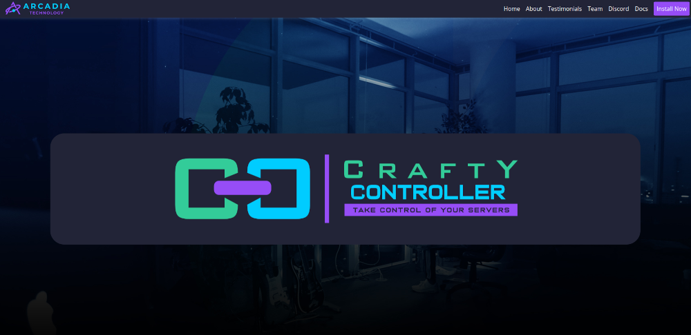
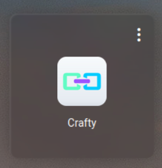
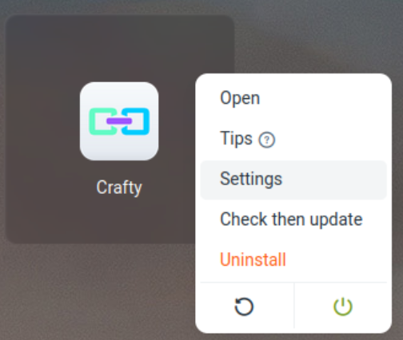
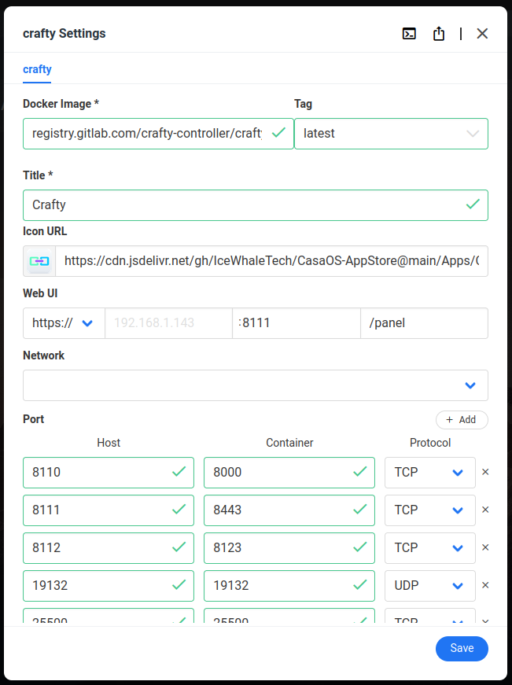
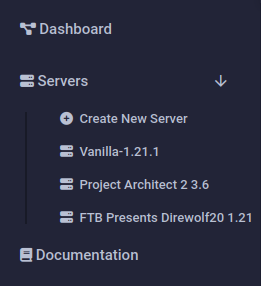
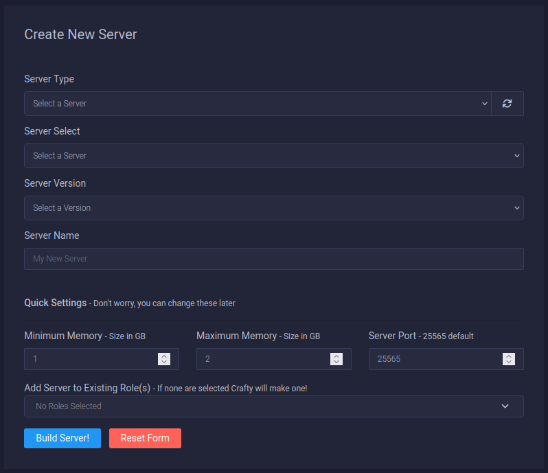
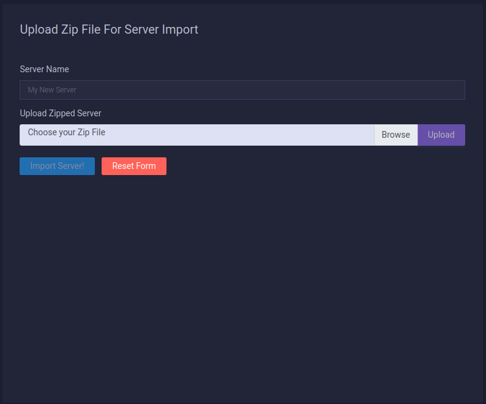
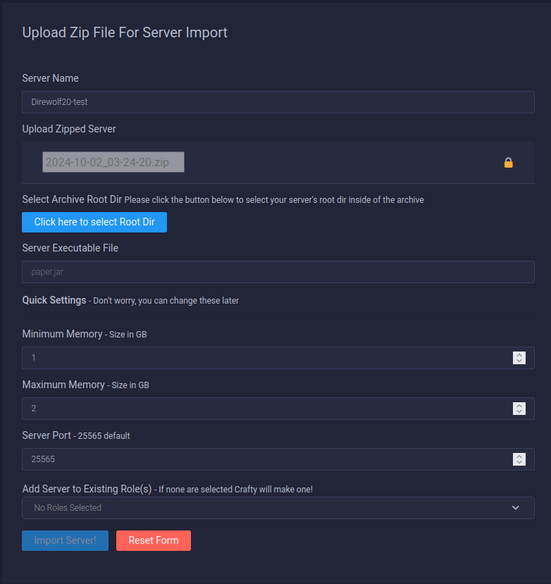
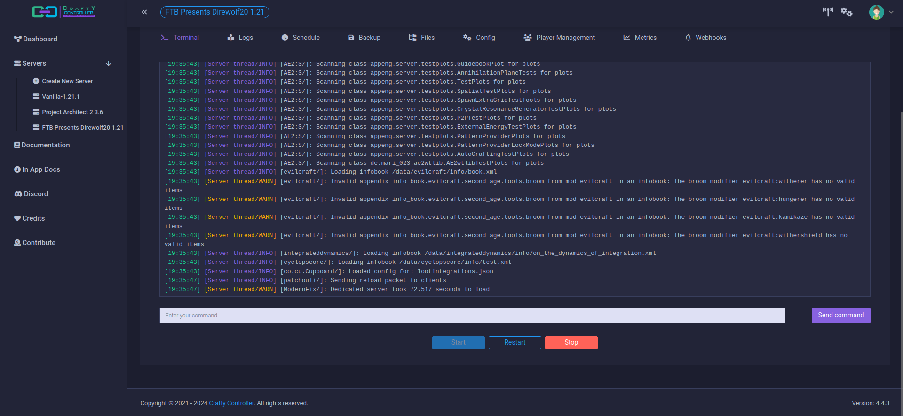
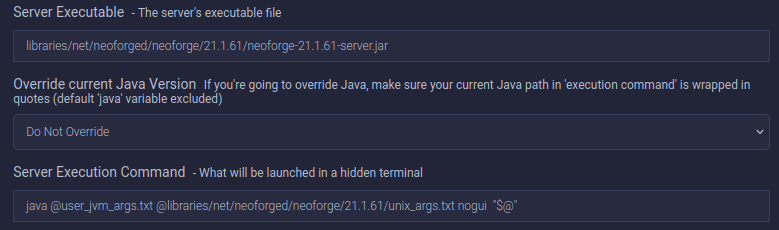

# Craft Controller


I use [Crafty Controller](https://craftycontrol.com/) to manage my Minecraft servers.
It is a free open-source application built and maintained by a volunteer staff.

Their website has decent documentation. Plus, they have a Discord channel for support. Be kind and patient if you reach out to them.

### Base Server
- I use [Debian](https://www.debian.org) without a GUI as my server operating system.
- During installation, I set a Hostname and Static IP to make managing the server easier. I save the IP address for later use.
- Then I install [CasaOS](https://casaos.zimaspace.com) as a front-end to manage docker containers.
- Last I use the CasaOS App Store to install Crafty. After installation here's how I configure it to pull the latest version.



I hover over the Crafty icon to see the three dots in the top right corner. I left-click the dots to see the menu.



When the menu pops up I left-click "Settings" to open the setting panel.



To the right of the "Docker Image *" field, I see the "Tag" field. I click the drop-down and set it to "latest".
Then I click the blue "Save" button at the bottom right of this screen.

CasaOS will update Crafty to the latest version. Once it's updated I can move to the next step.

### Minecraft Server Preparation
When I want to run a modded server there are a few things I have to prepare before adding the server to Crafty.

Either, I can download the server installer from [https://www.feed-the-beast.com/](https://www.feed-the-beast.com/). <br/>
Or, find the server installer on [Curseforge](https://www.curseforge.com/minecraft).

I use Linux as my desktop operating system. Some of these steps will be different on other operating systems.

1. I create a folder on my computer with the same name as the server I'm installing. (Example: Direwolf20)
2. Then I add the installer file to that folder. Sometimes I have to set the installer file permissions to allow execution of the file as a program. Either using the GUI or in the terminal with "sudo chmod +x server-name".
3. Then I run the installer in the terminal with "./servername".
4. The first time it runs it will stop and tell you to agree to the ELUA. Which means opening a text file in the folder and changing the default ELUA=false to true.
5. Then I rerun the server installer using "./server-name" until it completes.
6. Once installed, while still in the terminal, I run the server using "sh start.sh".
7. It gives me a few prompts to answer and I agree with everything. After the server finishes loading, if there are no errors, I stop the server with "CTRL + c" on the keyboard.
8. Once the server is shut down I select all the files in the folder and compress them into a zip file, giving it a short name with no spaces. I click the zip file to preview inside to make sure I see the list of files.

This completes the modded server preparation.<br/>
There are two ways I could install the server on Crafty.<br/>
Both methods require me to know the path to either the forge or neoforge server.jar file.

For the mod pack Direwolf20 1.21 here are the two paths you need: <br/>

Server Executible:
```shell
libraries/net/neoforged/neoforge/21.1.61/neoforge-21.1.61-server.jar
```
Server Execution Command:
```shell
java @user_jvm_args.text @libraries/net/neoforged/neoforge/21.1.61/unix_args.text nogui "$@"
```
These paths will be needed when configuring the server on Crafty.

### Installing the modded server on Crafty
Inside Crafty I go to the left-side menu. Under servers, I click, "Create new server".



1. I see the "Create New Server" form.



2. Under the first field "Server Type" I click the dropdown and select "Minecraft Servers".
3. Next under "Server Select" I click the dropdown and pick "forge-installer".
4. Next is "Server Version" and the dropdown gives me a list of options. I pick the one that matches the Minecraft version of the server I'm installing.
5. Then I give the server a name. Usually, I name it the same as the modded Minecraft server I want to run.
6. Last I set the minimum and maximum memory in GB for the modded Minecraft server to use. Because this hardware has 16GB of RAM and I'm only running one server at a time. I usually set the maximum memory to 10GB. This leaves 6GB for the server to manage other processes.
7. At the bottom of this form I click the blue button, "Build Server!". This opens the terminal screen so I can see the running processes. Almost immediately a popup appears and asks if I agree to the ELUA. I click "Yes" and the installation process continues.
8. Once the installation is complete I DO NOT RUN THE SERVER YET!
9. Instead, I click on "Files" at the top of the screen. Here I'm presented with a list of the files that make up the modded server.
10. On the page on the left I hover my mouse over the "Files" folder that contains all the server files. Then right-click to get a menu.
In that menu, I click "Upload" which opens a popup where I can click "Browse" to use my file browser to search for files to add.
11. This is where I select the zip file I made earlier. Once selected I click the "Upload" button at the bottom of the popup.
12. Depending on the size of the file it can take a few minutes to upload the zip file. The popup disappears when the upload is complete.
13. Now I see the zip in the list of files on the left. I right-click it and select "Unzip". This process can take a couple of minutes depending on the size of the zip file. The screen will refresh and show more files in the list when it's complete.
14. I right-click on the .zip file and click "Delete". A popup tells me this will delete the file completely and cannot be undone. It asks if I understand the consequences. I select, "Yes, I understand" and the zip file is removed.
15. Before I start the server I will paste in the correct paths to the forge or neoforge server.jar. These paths are different depending on the mod pack being installed. I use the example I added before this section to figure out what the correct path is for the server I'm installing.
16. Now I can click on "Terminal" at the top and click the blue "Start" button at the bottom. This will start the server.
Text will display on the screen letting me know what the server is doing. Any errors will show up in red. If the server crashes it will show up here and try to tell me why. The first run takes about a minute to complete. After that, it usually takes less time to start. Unless the modded server has a lot of included mods.
17. Now that the server is up and running I can open my Feed The Beast Minecraft client. I'll load the corresponding game and select multiplayer from the title screen.
18. When the multiplayer screen opens, at the bottom, I will click "Add Sever" and input the name of the server and the IP address. Then I click the "Done" button at the bottom.
19. It takes me back to the multiplayer connection screen. At the top, I see the name of the server and bars that indicate how strong the connection is between my client and the server. If I see all green bars I have a solid connection. Any errors will show as a red x.
20. Now I click on the name of the server and click "Join Server" at the bottom of the screen. A loading screen will open and after a couple of minutes, the game will load.
21. When I'm done with my game session. I exit my client and then go back to Crafty where I click on the terminal and the red "Stop" button. I wait for the server to shut down. Then I click on "Backup" at the top and run a backup of the server. When it's complete I click "Download" and save the backup somewhere secure just in case something happens to my server.

### Importing the modded server on Crafty
There is another way I added modded Minecraft servers to Crafty. I use the import server option. This is also how I restore a previously backed-up game from one server to another.

1. Either prepare the server as before or locate my most recent server backup.
2. I open Crafty and go to the Create Server menu.
3. Then I move to the "Upload Zip File For Server Import" screen.



4. I add the name of the server. Then click "Browse" and select the zip file I want to use.
5. Once selected I click "Upload". It takes a few minutes to complete.



6. After it's uploaded the form will change. I click the blue "Click here to select the Root Dir" button. This usually auto-selects the base folder displaying all the files I added to the zip. I know it's correct so I save it and move on.
7. Next I add the path to the Server Executable File. I reference the example I gave before to figure out what this should be.
8. Then I set the minimum and maximum memory for the server. Usually between 8 and 10. It depends on how much RAM the host server has. I don't want to give the game too much RAM or it will crash the host server.
9. I click the blue "Import Server!" button. This takes time. Once complete it will take me to the familiar "Terminal" tab inside the server.



10. Here I click on the "Config" tab to make minor adjustments. Before I run the server I want to confirm both paths are correct. If not then I will replace them with the correct paths before starting the server.



11. Once everything has been configured properly I return to the Terminal Tab and click the blue "Start" button. The server should load without errors.
I know it's ready when the last line in the terminal says something like, "Dedicated server took 72.517 seconds to load".
12. Now I can load my client and connect through the multiplayer screen like normal.
13. After I end my play session I will stop the server and run a backup. When the backup is complete I will download it and save it somewhere safe.

The import zip process is much faster but doesn't work for some servers. That's why I've written out both options.

When I have issues I check:<br/>
- DuckDuckGo by copying the error message and searching for the answer.
- The [Crafty Controller](https://craftycontrol.com/) website has great documentation.
- [r/CraftyController](https://www.reddit.com/r/CraftyController/) on Reddit
- Or, I visit the [Crafty Controller Discord](https://discord.com/invite/9VJPhCE)

Note: A recent update from Crafty version 4.4.3 to 4.4.4 has disabled access to the web interface. Don't update! This affects installations on CasaOS. I’m waiting for a fix.
